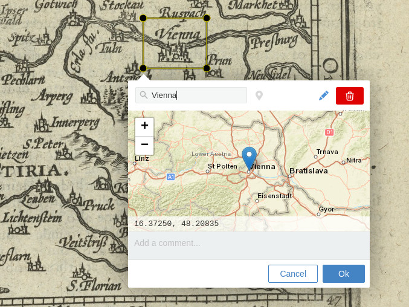

# Recogito Geotagging Widget

A geo-tagging editor widget for [Annotorious](https://annotorious.com) and 
[RecogitoJS](https://github.com/recogito/recogito-js). Try the [live demo here](https://recogito.github.io/geotagging-widget/).

 

## Install

Download the [latest release](https://github.com/recogito/geotagging-widget/releases) and include the JS script file. You can also get the script files directly from the CDN:

```html
<html>
  <head>
    <!-- Annotorious -->
    <link rel="stylesheet" href="https://cdn.jsdelivr.net/npm/@recogito/annotorious@latest/dist/annotorious.min.css">
    <script src="https://cdn.jsdelivr.net/npm/@recogito/annotorious@latest/dist/annotorious.min.js"></script>

    <!-- Geotagging Widget -->
    <script src="https://cdn.jsdelivr.net/npm/@recogito/geotagging-widget@latest"></script>
  </head>
  
  <body>
    <div id="content">
      
    </div>
    <script>
      (function() {
        // Widget configuration (optional!)
        var config = {
          // XYZ tileserver URL pattern, defaults to 'https://{s}.tile.openstreetmap.org/{z}/{x}/{y}.png',
          tileUrl: 'https://www.exampe-tileserver.com/tile/{z}/{y}/{x}',

          // Map origin for empty annotations, defaults to [0, 0]
          defaultOrigin: [ 48, 16 ],

          // Map zoom for empty annotations, defaults to 7
          defaultZoom: 10

          // Search endpoint, either String ('osm' | 'whg') or custom function
          search: 'osm'
        };

        var anno = Annotorious.init({
          image: 'hallstatt',
            widgets: [
            { widget: recogito.GeoTagging(config) },
            'COMMENT'
          ]
        });
      })()
    </script>
  </body>
</html>
```

If you use npm: `npm install @recogito/geotagging-widget` and

```js
import GeotaggingWidget from '@recogito/geotagging-widget';

const config = {
  defaultOrigin: [ 48, 16 ]
};

const anno = new Annotorious({
  image: imageEl,
  widgets: [
    { widget: GeotaggingWidget(config) },
  ]
});
```

The plugin is also compatible with [RecogitoJS](https://github.com/recogito/recogito-js). Initialization works the same way.

## Using Custom Gazetteers

To enable place search, the plugin includes connectors to two public gazetteer databases: OpenStreetMap through the public [Nominatim](https://nominatim.org/) API; and the API of the [World Historical Gazetteer](https://whgazetteer.org/). 

Please note that both of these services are free - but may impose their own rate and usage limits. You can also use the widget with other gazetteer search endpoints, by supplying a custom search function. See [this Wiki page](https://github.com/recogito/geotagging-widget/wiki/Using-Custom-Gazetteer-APIs) for details.

## License

[BSD 3-Clause](https://github.com/recogito/geotagging-widget/blob/main/LICENSE)

## Acknowledgements

This plugin was made possible thanks to the support [Huygens ING](https://www.huygens.knaw.nl/) and the [Golden Agents project](https://www.goldenagents.org/).

Sample images: 

- Epitome theatri Ortelianii, Abraham Ortelius, 1601. [Source: Wikimedia Commons, CC-BY-SA 4.0](https://commons.wikimedia.org/wiki/File:Epitome_theatri_Ortelianii,_Abraham_Ortelio.jpg)

- Austria (1603). [Source: NYPL, Wikimedia Commons, Public Domain](https://commons.wikimedia.org/wiki/File:Austria_(NYPL_b15404146-1632179).jpg)